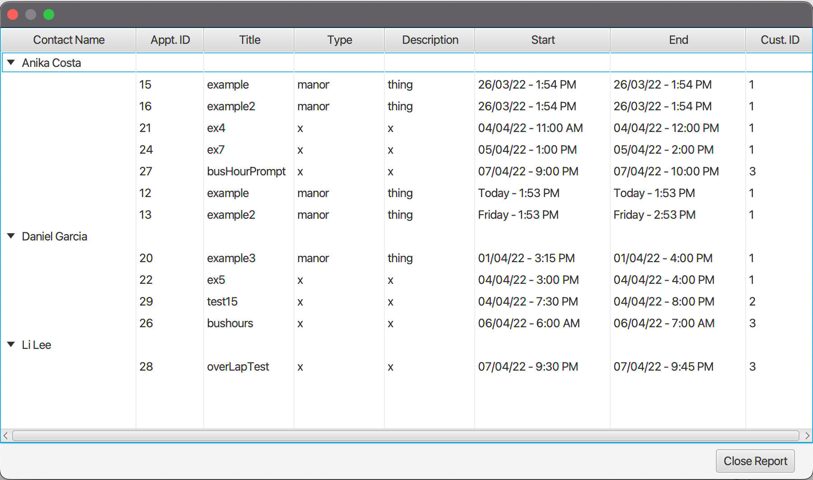

# Scheduling App

## Overview

A **Full Stack Java** application for scheduling appointments with customers. The app is built using a **3-Tier Architecture**, pulling from a **MySQL** database. UI is built in **JavaFX**. The project build tool is **Gradle**.

## Architecture

The application is structured in a 3-tier structure with a common library between the different layers. The 3 layers and library are built as Gradle projects and are titled as the following:

* Client (Front End)
* Business (Logic)
* Access (Back End)
* Common (Library)

## Screenshots

### Login Screen

### Home Screen &mdash; Customers Tab

### Home Screen &mdash; Appointments Tab

### Modify Appointment Form

### Dynamically Generated Contact Schedule Report

